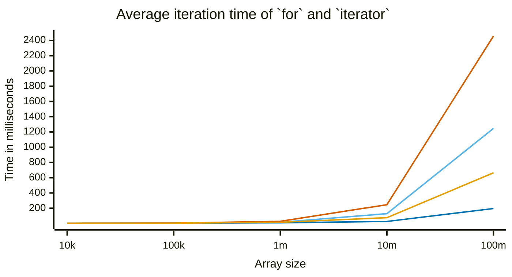
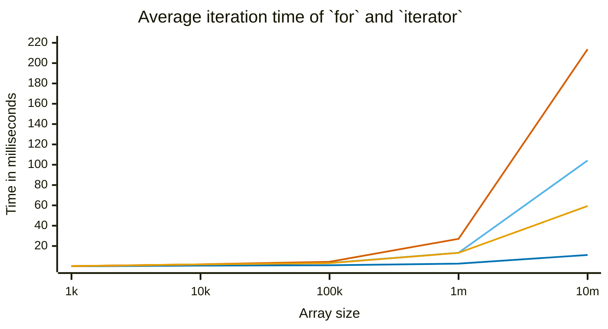

## Float64Array

## Array

### Conditions

Using `performance.now()` in Nodejs `v24` I calculated averages for 4 runs (program start, console log, program end).  
The goal was to iterate over all entries of an array filled with random numbers.  
The workload was one `if..else` to either add or subtract `value**2` from an accumulator variable. The loops were basically empty.  
The charts show 4 contenders:

1. a regular `for` loop, marked in dark blue.
2. `for of` using native generator, marked in bright blue.
3. `for of` using generator syntax sugar (`function*`), marked in dark orange.
4. `for of` using a hand rolled, optimized implementation of the [iterator protocol](https://developer.mozilla.org/en-US/docs/Web/JavaScript/Reference/Iteration_protocols#the_iterator_protocol), marked in bright orange.
   - it returns the same object (with updated `.value`) every time.

> [!IMPORTANT]
> Could not test `Array` with 100m entries due to `RangeError: Invalid array length` in the loop used to fill arrays with random numbers.

### Observation

A `Float64Array` is a contiguous, type constrained block of binary memory. It's very consistent.  
An `Array` is a contiguous block of pointers to random places in memory. It's less predictable.  
Generally, an iterated generator will create discardable objects and constantly call `.next()`.  
Loop **4** closely follows loop **2** up to ~1m iterations.  
All loops take practically the same amount of time up to ~1m iterations. _More testing is required, with real workload._  
Despite all loops taking practically the same amount of time, technically a `for` loop was always faster. Specifically (at 100m iterations):

- loop **2** was ~12 times slower.
- loop **3** was ~11 times slower.
- loop **4** was ~3.4 times slower.

### Conclusion

<u>Up to the reader.</u>
